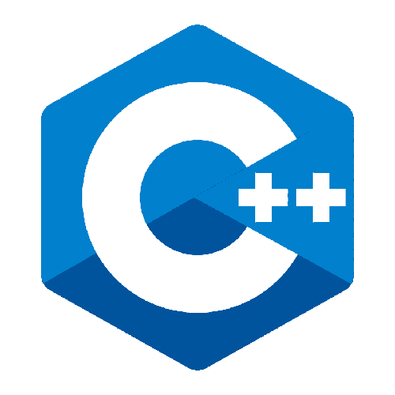

👋 Hi, I'm Adrian - aka [adyoblu] and I’m interested in any developer position. 
📫 Reach me by email: adyoblu2000@yahoo.com

---
### Connect with me:

&nbsp;&nbsp;

&nbsp;&nbsp;

&nbsp;&nbsp;

---

### Languages and Tools:

[][visual]
[][html5]
[][css3]
[][js]
[][nodejs]
[][git]
[][cpp]
[][java]
[][postgresql]
[][mongodb]

 

---

  
:zap: GitHub Stats

  [][adyoblu]

[adyoblu]: #
[postgresql]: https://www.postgresql.org/
[java]: https://www.java.com/en/
[cpp]: https://www.cplusplus.com/
[css3]: https://ro.wikipedia.org/wiki/Cascading_Style_Sheets
[html5]: https://ro.wikipedia.org/wiki/HTML5
[git]: https://git-scm.com/
[mongodb]: https://www.mongodb.com/
[nodejs]: https://nodejs.org/en/
[js]: https://www.javascript.com/
[visual]: https://code.visualstudio.com/
[instagram]: https://www.instagram.com/unknown_error_963/
[linkedin]: https://www.linkedin.com/in/oblu-ionu%C8%9B/
[facebook]: https://www.facebook.com/ionutoblu/